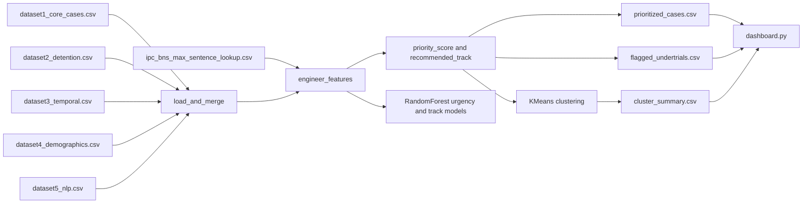
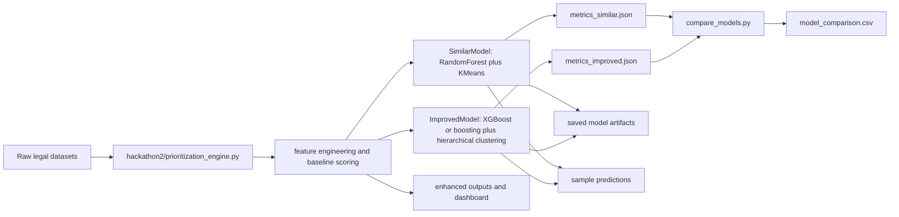

# <div align="center">LEGIRA</div>

<div align="center">
  

</div>

<div align="center">
  
  
  
  
  
 

</div>

<div align="center">
  <h3>
    <span style="color:#2f5597;">AI-assisted judicial triage for</span>
    <span style="color:#c00000;">over-detained</span>,
    <span style="color:#ed7d31;">delayed</span>, and
    <span style="color:#70ad47;">vulnerable</span> cases.
  </h3>
</div>

---

## 🌈 Overview

LEGIRA is a fairness-aware legal prioritization system built to help courts move beyond simple filing-order queues. It identifies cases that deserve earlier review by combining detention history, statutory punishment limits, stale-hearing patterns, vulnerability indicators, and ML-assisted classification.

This repository contains two major implementation stages:

- `Phase - 1`: baseline legal case prioritization and dashboard system
- `Phase - 2 & 3`: enhanced model-comparison system, improved artifacts, and expanded technical workflow

It also contains a separate blockchain prototype that can support future auditability.

---

## 👥 Team

<div align="center">
  
  
  
  
</div>

---

## ⚖️ Problem Statement

Judicial backlog is not only an operational delay problem. It is also a fairness problem.

Cases that should be reviewed urgently often get buried in ordinary queues, especially when they involve:

- undertrial prisoners detained beyond likely or statutory sentence exposure
- repeated adjournments and stale hearing histories
- vulnerable persons with age, disability, illness, or special care concerns
- bailable or low-severity matters that remain pending too long

LEGIRA is designed to surface these cases early and explain why they were prioritized.

---

## ✨ Core Capabilities

<table>
  <tr>
    <th align="left">Capability</th>
    <th align="left">Description</th>
  </tr>
  <tr>
    <td>📥 Multi-source ingestion</td>
    <td>Merges structured case, detention, temporal, demographic, and NLP-derived datasets.</td>
  </tr>
  <tr>
    <td>📚 Legal enrichment</td>
    <td>Uses IPC/BNS statute lookup tables to derive sentence ceilings and bailability context.</td>
  </tr>
  <tr>
    <td>🧮 Explainable scoring</td>
    <td>Builds a bounded <code>priority_score</code> using overstay, delay, severity, and vulnerability signals.</td>
  </tr>
  <tr>
    <td>🚨 Undertrial overstay detection</td>
    <td>Applies a critical override for fairness-sensitive detention cases.</td>
  </tr>
  <tr>
    <td>🤖 ML triage</td>
    <td>Predicts urgency and case-routing labels using trained classifiers.</td>
  </tr>
  <tr>
    <td>📈 Backlog segmentation</td>
    <td>Clusters cases into operational groups such as critical backlog and routine queue.</td>
  </tr>
  <tr>
    <td>🖥️ Dashboard review</td>
    <td>Supports filtering, ranking, flagged-case inspection, and new-case scoring in Streamlit.</td>
  </tr>
</table>

---

## 🏗️ Phase-Wise System Architecture

### 🟦 Phase 1 Architecture

Phase 1 is the **baseline prioritization system**. It focuses on direct case triage from structured data and presents the outputs in an initial Streamlit dashboard.



### 🟩 Phase 2 Architecture

Phase 2 extends the system into an **evaluation and comparison architecture**. It preserves the core prioritization engine while adding explicit model benchmarking and artifact export.



---

## 📂 File Path Architecture From `D:\LEGIRA\Phases`

The following architecture is derived from the main project folder `D:\LEGIRA\Phases`, with hidden `.git` content excluded. For readability, generated/vendor-heavy folders such as `node_modules`, virtual environments, and `__pycache__` are also omitted.

### 📁 `D:\LEGIRA\Phases\Phase - 1`

```text
D:\LEGIRA\Phases\Phase - 1
├── README.md
├── dashboard.py
├── prioritization_engine.py
├── generate_statute_lookup.py
├── requirements.txt
├── data
│   ├── dataset1_core_cases.csv
│   ├── dataset2_detention.csv
│   ├── dataset3_temporal.csv
│   ├── dataset4_demographics.csv
│   ├── dataset5_nlp.csv
│   ├── ipc_bns_max_sentence_lookup.csv
│   └── ipc_bns_statutes_master.csv
└── outputs
    ├── cluster_summary.csv
    ├── evaluation_metrics.json
    ├── flagged_undertrials.csv
    ├── prioritized_cases.csv
    └── synthetic_demo_cases.csv
```

### 📁 `D:\LEGIRA\Phases\Phase - 2 & 3`

```text
D:\LEGIRA\Phases\Phase - 2 & 3
├── logo.jpeg
├── Gemini_Generated_Image_ic00psic00psic00.png
├── package.json
├── package-lock.json
├── hackathon2
│   ├── MODELS_README.md
│   ├── MODEL_CREATION_SUMMARY.md
│   ├── compare_models.py
│   ├── dashboard.py
│   ├── generate_statute_lookup.py
│   ├── model_improved.py
│   ├── model_similar.py
│   ├── prioritization_engine.py
│   ├── requirements.txt
│   ├── data
│   │   ├── dataset1_core_cases.csv
│   │   ├── dataset2_detention.csv
│   │   ├── dataset3_temporal.csv
│   │   ├── dataset4_demographics.csv
│   │   ├── dataset5_nlp.csv
│   │   ├── ipc_bns_max_sentence_lookup.csv
│   │   └── ipc_bns_statutes_master.csv
│   ├── outputs
│   │   ├── cluster_summary.csv
│   │   ├── evaluation_metrics.json
│   │   ├── flagged_undertrials.csv
│   │   ├── prioritized_cases.csv
│   │   └── synthetic_demo_cases.csv
│   └── comparison_outputs
│       ├── detailed_metrics.json
│       ├── model_comparison.csv
│       ├── sample_predictions.csv
│       ├── improved_models
│       └── similar_models
└── js-crypto-model1
    ├── .gitignore
    ├── Block
    │   ├── block.js
    │   └── block.test.js
    ├── blockchain.js
    │   ├── blockchain.js
    │   └── blockchain.test.js
    ├── chain-util.js
    ├── config.js
    ├── dev-test.js
    ├── index.js
    ├── miner.js
    ├── p2p-server.js
    ├── package.json
    ├── package-lock.json
    ├── tester.js
    └── wallet
        ├── index.js
        ├── index.test.js
        ├── transaction-pool.js
        ├── transaction-poot.test.js
        ├── transaction.js
        └── transaction.test.js
```

---

## 📊 Checked-In Results

<table>
  <tr>
    <th align="left">Metric</th>
    <th align="left">Result</th>
  </tr>
  <tr>
    <td>Urgency classification accuracy</td>
    <td><b>88.43%</b></td>
  </tr>
  <tr>
    <td>Case-type classification accuracy</td>
    <td><b>73.97%</b></td>
  </tr>
  <tr>
    <td>Undertrial detection recall</td>
    <td><b>100%</b></td>
  </tr>
  <tr>
    <td>Dashboard filter response time</td>
    <td><b>3.26 ms</b></td>
  </tr>
  <tr>
    <td>Ranked-list agreement (Spearman)</td>
    <td><b>0.8942</b></td>
  </tr>
</table>

### 📌 Output Inventory

- `prioritized_cases.csv`: `1,206` ranked cases
- `flagged_undertrials.csv`: `321` flagged undertrial cases
- `cluster_summary.csv`: `4` clusters
- `synthetic_demo_cases.csv`: `6` demo cases

---

## 🤖 Model Comparison

<table>
  <tr>
    <th>Metric</th>
    <th>Similar Model</th>
    <th>Improved Model</th>
    <th>Winner</th>
  </tr>
  <tr>
    <td>Urgency Accuracy</td>
    <td>88.43%</td>
    <td><b>88.84%</b></td>
    <td>🟢 Improved</td>
  </tr>
  <tr>
    <td>Urgency Weighted F1</td>
    <td>88.46%</td>
    <td><b>88.98%</b></td>
    <td>🟢 Improved</td>
  </tr>
  <tr>
    <td>Track Accuracy</td>
    <td><b>73.14%</b></td>
    <td>72.31%</td>
    <td>🔵 Similar</td>
  </tr>
  <tr>
    <td>Track Weighted F1</td>
    <td>68.78%</td>
    <td><b>70.39%</b></td>
    <td>🟢 Improved</td>
  </tr>
  <tr>
    <td>Undertrial Recall</td>
    <td><b>100%</b></td>
    <td><b>100%</b></td>
    <td>🟡 Tie</td>
  </tr>
</table>

---

## 🚀 Run Instructions

### Phase 1 baseline

```bash
cd "Phases/Phase - 1"
python -m venv .venv
source .venv/bin/activate
pip install -r requirements.txt
python prioritization_engine.py --data-dir data --output-dir outputs
streamlit run dashboard.py
```

### Phase 2 enhanced pipeline

```bash
cd "Phases/Phase - 2 & 3/hackathon2"
python -m venv .venv
source .venv/bin/activate
pip install -r requirements.txt
python prioritization_engine.py --data-dir data --output-dir outputs --augment-demo
python compare_models.py
streamlit run dashboard.py
```

### Blockchain prototype

```bash
cd "Phases/Phase - 2 & 3/js-crypto-model1"
npm install
npm test
npm run dev
```

---

## 📸 Screenshot Guide


---

## 📘 Documentation

- IEEE paper: [docs/LEGIRA_IEEE_Paper.md](docs/LEGIRA_IEEE_Paper.md)
- Word-friendly paper: [docs/LEGIRA_IEEE_Paper_Word_Friendly.rtf](docs/LEGIRA_IEEE_Paper_Word_Friendly.rtf)

---

## 🏁 Final Note

LEGIRA is designed as a legal intelligence layer for smarter hearing-order decisions. Its core contribution is not only prediction, but explainable prioritization for fairness-sensitive judicial review.
